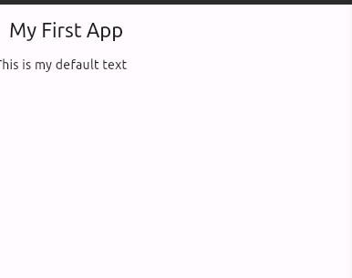
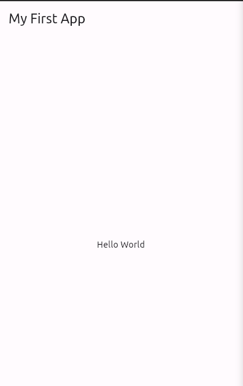

# Currency Converter

 ### starting point for a Flutter application.
 ```dart

import 'package:flutter/material.dart';
void main(){
  runApp(app);
}
```

This is the entry point of a flutter application. as an entry point it will run our `app`. `runApp` is a function that takes a widget and runs it. In this case, the widget is `app`. `app` can be any UI component. 

-i.e

```dart
void main(){
  runApp(Text("Hello World", textDirection: TextDirection.ltr));
}
```
We want to have an application where individual components can be reused and worked on separately. This is why we have the `app` widget. The `app` widget is a `StatelessWidget`. A `StatelessWidget` is a widget that does not change. It is immutable.

The above code can be relaced with the following code:

```dart
import 'package:flutter/material.dart';
void main(){
  // ignore: prefer_const_constructors
  runApp(const MyApp());
}

// MaterialApp or CupertinoApp
// creating our own widget
class MyApp extends StatelessWidget {
    const MyApp({super.key});

  @override
  Widget build(BuildContext context){
    // ignore: prefer_const_constructors
    return const Text("Hello World", textDirection: TextDirection.ltr,);
  }
}
```

- @override - this allows us to override the default widget and get to fill it with our own code.
- const - this tells flutter that the widget does not need to be recreated every time the build method is called. This is because the widget does not change. It is immutable. Helps improve performance.

***
There are a couple designs you can use instead of creating yours from sratch. These are `MaterialApp` and `CupertinoApp`. These are the two main designs. They are the main entry points for flutter applications. Material is built by google and is the default design. Cupertino is built by apple and is the design used in iOS. 

In this case, it is a `MaterialApp` widget. `MaterialApp


```dart
import 'package:flutter/material.dart';
void main(){
  // ignore: prefer_const_constructors
  runApp(const MyApp());
}

// MaterialApp or CupertinoApp
// creating our own widget
class MyApp extends StatelessWidget {
   const MyApp({super.key}); //const MyApp({Key? key}) : super(key: key); 

  @override
  Widget build(BuildContext context){
    // ignore: prefer_const_constructors
    return MaterialApp(
      debugShowCheckedModeBanner: false,
      home: Scaffold(
        appBar: AppBar(
          title: const Text('My First App'),
        ),
        body: const Text('This is my default text'),
      ),
    );
  }
}
```



## Separating the Widgets

### main.dart

```dart
import 'package:currency_converter/currency_converter_material_page.dart';
import 'package:flutter/material.dart';
void main(){
  // ignore: prefer_const_constructors
  runApp(const MyApp());
}

// MaterialApp or CupertinoApp
// creating our own widget
class MyApp extends StatelessWidget {
   const MyApp({super.key}); //const MyApp({Key? key}) : super(key: key); 

  @override
  Widget build(BuildContext context){
    // ignore: prefer_const_constructors
    return MaterialApp(
      debugShowCheckedModeBanner: false,
      home: const CurrencyConverterMaterialPage(),
    );
  }
}
```

### currency_converter_material_page.dart

```dart
import 'package:flutter/material.dart';

class CurrencyConverterMaterialPage extends StatelessWidget {
  const CurrencyConverterMaterialPage({Key? key}) : super(key: key);

  @override
  Widget build(BuildContext context) {
    return Scaffold(
        appBar: AppBar(
          title: const Text('My First App'),
        ),
        body: const Center(
          child: Text('Hello World'),
        )
      );
  }
}
```

- BuildContext - the current state of the widget. It is a reference to the widget we are building. Tells you the location of the current widget anf the widget tree.



When choosing widgets, consder what you want it to hold, it is in a body and myight hold other widgets chooose a widget that can accomodate many, i.e a `column` or `row`. These two can hold children unlike a `Center widget` which can only hold one child.

`column` tells flutter to expect a list and the layout of them as well.
You can wrap the column in a `Center` widget to center the column.

```dart
import 'package:flutter/material.dart';

class CurrencyConverterMaterialPage extends StatelessWidget {
  const CurrencyConverterMaterialPage({Key? key}) : super(key: key);

  @override
  Widget build(BuildContext context) {
    return Scaffold(
        appBar: AppBar(
          title: const Text('currency converter'),
        ),
        body: const Center(
          child: Column(
            mainAxisAlignment: MainAxisAlignment.center,
            children: [
              Text('0')
            ],
          ),
        )
      );
  }
}
```

here:
- `mainAxisAlignment` - tells flutter how to align the children of the column. In this case, we want to align them in the center. But it will still be at the edgest of the screen. To fix this, we can wrap the column in a `Center` widget. This will center the column in the screen. Or we can add a `crossAxisAlignment` to the column and set it to `crossAxisAlignment.center`. This will center the column in the screen.